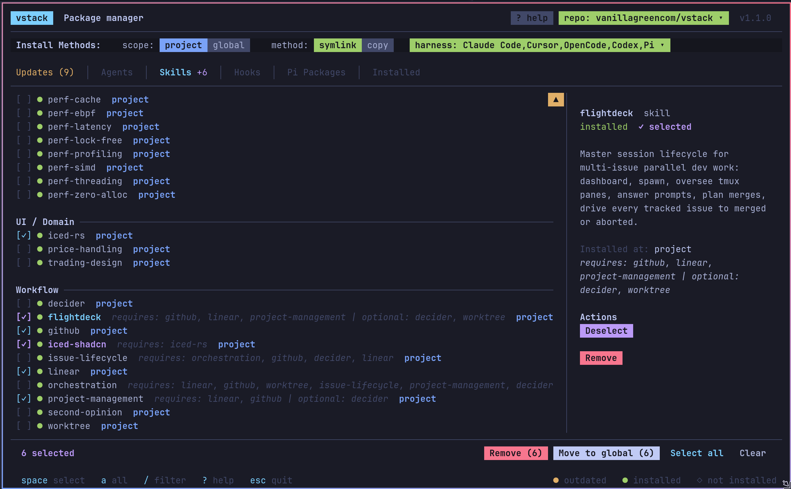

# vstack

Cross-harness package manager for AI coding systems.

Author skills, agents, and hooks once. Install into Claude Code, Cursor, OpenCode, Codex, and Pi from one Rust CLI.

[](./cli/Cargo.toml)
[](https://ratatui.rs)
[](#supported-harnesses)
[](#supported-harnesses)
[](#supported-harnesses)
[](#supported-harnesses)
[](#supported-harnesses)



---

## What Is vstack?

- Rust CLI/TUI for discovering, installing, updating, and removing AI coding packages.
- Maintained catalog in this repo (agents, skills, hooks, Pi extensions).
- Packages authored harness-agnostic; vstack translates per harness at install.
- Source repo is swappable — this catalog is the default, not the only one.

## Features

- **Cross-harness install** — Claude Code, Cursor, OpenCode, Codex, Pi from one CLI.
- **Global or project scope** — install per user or per project.
- **Skill dependencies** — required deps install transitively; optional deps stay documentation-only.
- **Config-driven attribution** — `vstack.toml` maps skills/hooks to agents and roles.
- **Project customization** — per-agent guidance, colors, custom skills, per-skill instructions, custom hooks. Survives upstream updates.
- **Reconciliation** — agents/skills regenerate on changes, preserving user edits.
- **Lockfile refresh** — `vstack refresh` reinstalls all locked items; `--scope project|global|all` narrows.
- **Source switching** — multiple package repos persisted in a global registry, swappable from the TUI.
- **Fast TUI** — native Rust + mouse, built on `ratatui`/`crossterm`.

## Quick Start

```bash
cargo install --git https://github.com/vanillagreencom/vstack.git vstack
vstack add vanillagreencom/vstack   # interactive installer
```

### Commands

| Command | Default scope | What it does |
|---|---|---|
| `vstack add <source>` | project | Install items (TUI by default; non-interactive with `-y` and item filters) |
| `vstack remove <names>` | project | Uninstall items |
| `vstack list` (alias `ls`) | all | Show installed items grouped by scope |
| `vstack check` | all | Validate install state (outdated, orphaned, missing) |
| `vstack refresh` | all | Reinstall locked items from current source. `--verbose`/`-v` prints per-item hash old→new with changed/unchanged status |
| `vstack verify` | all | Confirm the live install matches its source on disk: lock hash vs current source, plus byte-level source-vs-install comparison for Pi packages. Exits non-zero on drift |
| `vstack update-pi` | all | Update Pi packages by version (npm sources or vstack repos) |
| `vstack update` | n/a | Self-update the CLI binary |
| `vstack init <name> --kind <agent\|skill\|hook>` | n/a | Scaffold a new template in a vstack source repo |

All scope-aware commands accept `--scope project|global|all`. `-g`/`--global` is shorthand for `--scope global`. When both are passed, `--scope` wins.

Non-interactive `add` examples (item filters `--agent`, `--skill`, `--hook`, `--pi-extension` restrict the install; `--all` includes everything; `-y` skips the TUI):

```bash
vstack add vanillagreencom/vstack --pi-extension pi-web-tools --harness pi -y
vstack add vanillagreencom/vstack --global --skill decider -y
vstack add vanillagreencom/vstack --global --all -y
```

## Project-Local Config

Two files at the project root:

- **`vstack.toml`** — agent customization. Auto-created by `vstack add`. Edit, then `vstack refresh`. See [Project Customization](#project-customization).
- **`.env.local`** — skill config (tokens, paths, auth). Copy from [.env.local.example](./.env.local.example). Symlinked into worktrees by the `worktree` skill.

## How It Works

### Mental Model

A source repo is a package registry:

- `agents/*.md` — agent definitions
- `skills/*/SKILL.md` — skill packages (rules, scripts, workflows alongside)
- `hooks/*.sh` — safety hooks
- `pi-extensions/*/package.json` — npm-shaped Pi extension packages
- `vstack.toml` — mapping and attribution rules

### Dependencies And Mapping

**Skill dependencies.** A skill lists the other skills it needs in its `SKILL.md` frontmatter:

```yaml
dependencies:
  required: [linear, orchestration, decider]
  optional: []
```

`required` deps install transitively whenever the skill installs. `optional` deps are documentation only — they're not auto-installed.

**Agent attribution.** The source repo's `vstack.toml` decides which skills and hooks attach to which agents:

- `[agent-skills]` — explicit skills per agent.
- `[role-skills]` — skills added to every agent of a role (`engineer`, `reviewer`, `manager`).
- `[hook-events]` — hooks attached by event/matcher, scoped to roles or `"all"`.

```toml
[agent-skills]
rust = ["rust-arch", "rust-async", "rust-cargo"]
iced = ["iced-rs", "iced-shadcn"]

[role-skills]
engineer = ["issue-lifecycle", "github", "worktree", "decider", "linear"]
reviewer = ["issue-lifecycle", "linear"]

[hook-events]
"PreToolUse:Bash" = "all"
"PostToolUse:Edit|Write" = ["engineer"]
```

### Project Customization

`vstack add` auto-creates `vstack.toml` with placeholders for each installed agent and skill. Edit, then `vstack refresh`. All sections survive upstream updates — re-applied on every install/refresh.

```toml
# Launch instruction per agent.
[agent-launch-instructions]
rust = "Read open issues, pick up the highest-priority backend task."
generalist = ""    # empty = no section

# Extra rules appended to the agent file.
[agent-additional-instructions]
rust = "Always run clippy before committing."

# Skills per agent. Auto-populated; edit freely.
[agent-skills]
rust = ["rust-arch", "rust-cargo", "decider", "github", "worktree"]
iced = ["iced-rs", "trading-design", "decider", "github", "worktree"]

# Agent display color written to supported agent frontmatter.
# Pi subagent panes use this for the statusline badge background.
[agent-colors]
rust = "green"
iced = "magenta"

# Project instructions appended to a skill's SKILL.md.
[skill-instructions]
trading-design = "Dark theme, green/red accents."

# Custom hooks. Claude Code runs the command; others use description as inline rules.
[[custom-hooks]]
event = "PreToolUse"
matcher = "Bash"
command = "./scripts/no-force-push.sh"
description = "Never `git push --force` on main or master."
agents = "all"     # "all" | role | [agent names]
```

Direct edits to generated agent/skill files are extracted into `vstack.toml` before the next regeneration — both approaches work.

### Architecture

```text
source repo
├─ agents/*.md
├─ skills/*/SKILL.md
├─ hooks/*.sh
└─ vstack.toml
        │
        ▼
   vstack CLI / TUI
   - discovers packages
   - resolves dependencies
   - selects repo / scope / harnesses / method
   - applies mapping rules
        │
        ├─ Claude Code → .claude/agents, .claude/skills, .claude/hooks, settings.json
        ├─ Cursor      → .cursor/rules
        ├─ OpenCode    → .opencode/agents, .opencode/skills, opencode.json
        ├─ Codex       → .codex/agents, .agents/skills
        └─ Pi          → .pi/agents, .agents/skills, .pi/packages, .pi/settings.json
```

### Repo Sources

Default: `vanillagreencom/vstack`. The TUI switches between remembered repos or adds new ones (GitHub shorthand or URL).

Compatible repos:

```text
agents/
skills/
hooks/
pi-extensions/   # optional
vstack.toml
```

## Supported Harnesses

| Harness | Agents | Skills | Hooks | Notes |
|---|---|---|---|---|
| Claude Code | `.claude/agents/*.md` | `.claude/skills/<name>/` | native `.claude/hooks/*.sh` + `settings.json` | richest native hook support |
| Cursor | `.cursor/rules/*.mdc` | `.cursor/rules/<name>/` | safety rules only | project scope only |
| OpenCode | `.opencode/agents/*.md` | `.opencode/skills/<name>/` | instructions + `opencode.json` permissions | config-dir aware |
| Codex | `.codex/agents/*.toml` | `.agents/skills/<name>/` | safety prose in `developer_instructions` | uses `CODEX_HOME` when set |
| Pi | `.pi/agents/*.md` | `.agents/skills/<name>/` | safety prose in agent body | extensions install to `.pi/packages/<name>` and register in `.pi/settings.json` |

Global install behavior:

- Claude Code: user home `~/.claude`
- OpenCode: config-dir based, respecting `OPENCODE_CONFIG` / `OPENCODE_CONFIG_DIR`
- Codex: `CODEX_HOME` or `~/.codex`
- Pi: `~/.pi/agent`, respecting `PI_CODING_AGENT_DIR`
- Cursor: intentionally project-only

### Pi notes

- **Agents.** `.pi/agents/*.md` are inert without a loader extension (`pi-agents-tmux`). `pi-session-bridge` is a separate TUI side-channel for external controllers.
- **Hooks.** No native runtime; safety prose is appended to the agent body.
- **Extensions.** `vstack add` copies to `<scope>/packages/<name>`, registers in `settings.json`, symlinks each `bin` entry to `<scope>/bin/<cli>`. Add `<scope>/bin` to `PATH`. `vstack remove` cleans all three.
- **Scope is exclusive.** Pi loads global + project together — duplicate registration crashes startup. vstack skips duplicates with a notice; use `vstack remove [-g]` to switch.

Windows: CLI runs natively; symlink mode falls back to copy on non-Unix targets.

## Package Catalog In This Repo

### Agents

| Agent | Role | Brief |
|---|---|---|
| `generalist` | engineer | General maintenance, cleanup, docs, stale references, and project hygiene. |
| `iced` | engineer | Iced UI implementation and architecture specialist. |
| `researcher` | engineer | Exa-powered research specialist for evidence-backed findings reports. |
| `rust` | engineer | Rust engineer for systems work, performance, zero-allocation, and low-level design. |
| `tpm` | manager | Technical program management and roadmap analysis agent. |
| `reviewer-arch` | reviewer | Reviews boundaries, abstractions, and architectural drift. |
| `reviewer-doc` | reviewer | Reviews documentation accuracy and stale docs. |
| `reviewer-error` | reviewer | Reviews error handling, silent failures, and propagation. |
| `reviewer-perf` | reviewer | Reviews latency, benchmarks, and performance regressions. |
| `reviewer-safety` | reviewer | Reviews unsafe Rust, memory safety, and concurrency correctness. |
| `reviewer-security` | reviewer | Reviews auth, input handling, and security risks. |
| `reviewer-structure` | reviewer | Reviews modularity, file size, and code organization. |
| `reviewer-test` | reviewer | Reviews test coverage, missing cases, and test quality. |

### Skills

`*` = needs project-local setup; see that skill's README.

#### Rust

| Skill | Brief |
|---|---|
| [`rust-arch`](skills/rust-arch/) | Rust architecture rules, anti-patterns, and review heuristics. |
| [`rust-async`](skills/rust-async/) | Async internals, runtime patterns, cancellation, and concurrency composition. |
| [`rust-cargo`](skills/rust-cargo/) | Cargo workflows, workspaces, feature flags, and build/release config. |
| [`rust-conventions`](skills/rust-conventions/) | Style, layout, tests, and definition-of-done conventions. |
| [`rust-cross`](skills/rust-cross/) | Cross-compilation, target setup, and multi-platform builds. |
| [`rust-debugging`](skills/rust-debugging/) | GDB/LLDB, tracing, panic triage, and async runtime debugging. |
| [`rust-ffi`](skills/rust-ffi/) | Safe C interop and FFI wrapper patterns. |
| [`rust-no-std`](skills/rust-no-std/) | `no_std` design, alloc boundaries, and embedded-friendly structure. |
| [`rust-safety`](skills/rust-safety/) | Unsafe code review, SAFETY comments, and safety audit patterns. |

#### Performance

| Skill | Brief |
|---|---|
| [`perf-cache`](skills/perf-cache/) | Cache locality, false sharing, and data layout optimization. |
| [`perf-ebpf`](skills/perf-ebpf/) | Aya/eBPF instrumentation and kernel-level observability. |
| [`perf-latency`](skills/perf-latency/) | Benchmarking and percentile-focused latency measurement. |
| [`perf-lock-free`](skills/perf-lock-free/) | Atomics, loom verification, and lock-free correctness. |
| [`perf-profiling`](skills/perf-profiling/) | Flamegraphs, hotspot analysis, NUMA, and jitter investigation. |
| [`perf-simd`](skills/perf-simd/) | SIMD, auto-vectorization, intrinsics, and runtime dispatch. |
| [`perf-threading`](skills/perf-threading/) | Pinning, topology-aware concurrency, and jitter reduction. |
| [`perf-zero-alloc`](skills/perf-zero-alloc/) | Eliminating allocations in hot paths. |

#### UI / Domain

| Skill | Brief |
|---|---|
| [`iced-rs`](skills/iced-rs/) | Iced 0.14 patterns, reactive UI rules, and Elm-style structure. |
| [`iced-shadcn`](skills/iced-shadcn/) | shadcn Base UI component planning, family decomposition, and parity audits for Iced. |
| [`price-handling`](skills/price-handling/) | Price rounding, epsilon comparison, and market-price handling. |
| [`trading-design`](skills/trading-design/) | Dense, professional trading-style interface design guidance. |

#### Workflow / Platform

| Skill | Brief | Commands |
|---|---|---|
| [`decider`](skills/decider/)* | Architectural decision document management and indexing. | — |
| [`deep-research`](skills/deep-research/) | Exa-powered deep research and portable findings report generation. | `scripts/deep-research report "question" --output findings.md`, `scripts/deep-research doctor` |
| [`github`](skills/github/)* | GitHub PR, thread, review, CI, and merge workflows. | — |
| [`issue-lifecycle`](skills/issue-lifecycle/)* | Delegated implementation/review/QA issue workflows. | — |
| [`linear`](skills/linear/)* | Linear issue, cycle, milestone, and project workflows. | — |
| [`flightdeck`](skills/flightdeck/)* | Master session lifecycle for multi-issue parallel dev work; tmux-only. | `/flightdeck start [ISSUE_ID]`, `/flightdeck parallel-check`, `/flightdeck watch`, `/flightdeck status` |
| [`orchestration`](skills/orchestration/)* | Per-issue inside-worktree lifecycle: dev → review → submit → merge. | `/orchestration start`, `/orchestration dev-start`, `/orchestration ci-fix`, `/orchestration review-pr`, `/orchestration submit-pr`, `/orchestration merge-pr` |
| [`project-management`](skills/project-management/)* | TPM-orchestrated planning, audit, roadmap, research-driven decomposition. | `/project-management cycle-plan`, `/project-management audit-issues`, `/project-management roadmap plan`, `/project-management roadmap create`, `/project-management research-spike`, `/project-management research-complete` |
| [`second-opinion`](skills/second-opinion/) | Cross-model review via external AI CLI; auto-detects harness and calls the opposite (Claude ↔ Codex). | `/second-opinion review`, `/second-opinion challenge`, `/second-opinion audit`, `/second-opinion quick` |
| [`worktree`](skills/worktree/)* | Git worktree creation, env/config linkage, and isolated workflows. | `/worktree create`, `/worktree list`, `/worktree remove`, `/worktree push`, `/worktree check` |

### Hooks

| Hook | Event | Brief |
|---|---|---|
| `block-bare-cd` | `PreToolUse` | Blocks unsafe bare `cd` usage and nudges toward subshell-safe patterns. |
| `pre-commit-check` | `PreToolUse` | Validates formatting and lint before commits. |
| `post-edit-lint` | `PostToolUse` | Runs lint checks after source edits. |
| `task-completed-check` | `TaskCompleted` | Runs final lint checks before marking work complete. |

### Pi Extensions

All Pi packages declare `vstack.extensionManager.settings` (including an `enabled` toggle). Install `pi-extension-manager` to browse/edit from Pi.

| Extension | Purpose |
|---|---|
| [`pi-agents-tmux`](pi-extensions/pi-agents-tmux/README.md) | Delegate work to `.pi/agents` / `.claude/agents` with isolated context and persistent tmux panes (`subagent`, `get_subagent_result`, `steer_subagent`, `/agents`). |
| [`pi-background-tasks`](pi-extensions/pi-background-tasks/README.md) | Non-blocking shell tasks via `bg_task`/`bg_status` plus a `/bg` dashboard so long-running commands do not block the turn. |
| [`pi-caveman`](pi-extensions/pi-caveman/README.md) | Native Pi caveman communication mode via `before_agent_start` prompt injection (`/caveman`). |
| [`pi-claude-bridge`](pi-extensions/pi-claude-bridge/README.md) | Claude Code provider bridge (`claude-bridge/*`) with vstack-controlled Pi prompt-context forwarding. |
| [`pi-codex-minimal-tools`](pi-extensions/pi-codex-minimal-tools/README.md) | Adds Codex-style `view_image`, `apply_patch`, native OpenAI `image_generation` without replacing Pi's native file/shell/edit tools. |
| [`pi-extension-manager`](pi-extensions/pi-extension-manager/README.md) | Pi-styled package manager (`/extensions`) plus separate inline settings editor (`/extensions:settings`). |
| [`pi-output-policy`](pi-extensions/pi-output-policy/README.md) | OMP-style large-output policy: shell minimization, head/tail truncation, spill-file preservation, UI-safe caps. |
| [`pi-prompt-stash`](pi-extensions/pi-prompt-stash/README.md) | Per-session prompt stash history with stash/pop editor (`Alt+S`). |
| [`pi-qol`](pi-extensions/pi-qol/README.md) | Compact statusline/`π` prompt, multiline input, image chips, session naming/search/handoff, custom compaction, thinking timer. |
| [`pi-questions`](pi-extensions/pi-questions/README.md) | Structured multi-tab popup questions for the model with bridge-driven replies. |
| [`pi-session-bridge`](pi-extensions/session-bridge/README.md) | Unix-socket JSONL side channel + `pi-bridge` CLI for external control, event streaming, prompt sending, and answering `pi-questions`. |
| [`pi-session-manager`](pi-extensions/pi-session-manager/README.md) | Polished session browser (`/sessions`) for searching, resuming, renaming, and deleting Pi sessions. |
| [`pi-skills-manager`](pi-extensions/pi-skills-manager/README.md) | Dedicated `/skill` shell for browsing, creating, editing, and toggling Pi skills; expands `[skill] <name>` markers before sending prompts. |
| [`pi-task-panel`](pi-extensions/pi-task-panel/README.md) | Persistent structured task panel above the status line plus `/tasks` commands and `tasks_write` tool. |
| [`pi-tool-renderer`](pi-extensions/pi-tool-renderer/README.md) | Compact Claude/opencode-style renderers for built-in `read`/`bash`/search/mutation tools while preserving original execution. |
| [`pi-web-tools`](pi-extensions/pi-web-tools/README.md) | First-party web stack: provider-toggled `web_search` (Exa, Perplexity, Gemini, no-key Exa MCP/DuckDuckGo, OpenAI native), Exa deep research, and `web_fetch` extraction with HTML chrome strip + Jina fallback, GitHub clone cache, scanned-PDF vision OCR, YouTube/local video understanding, and Exa Code `/context` for `code_search`. See also [`EXA.md`](pi-extensions/pi-web-tools/EXA.md). |

Source layout:

```text
pi-extensions/
└─ <name>/
   ├─ package.json        npm-shaped, with `pi.extensions` and optional `bin`
   ├─ extensions/*.ts     loaded by Pi via the `pi.extensions` manifest
   ├─ bin/*               optional CLI scripts
   ├─ README.md
   └─ THIRD_PARTY_NOTICES.md  optional attribution for vendored/base code
```

#### Settings layout

vstack writes Pi's `packages` as relative paths (resolved against the settings file dir):

```json
{
  "packages": [
    "./packages/pi-session-bridge",
    "./packages/pi-qol"
  ]
}
```

| Scope | Settings file | Packages directory |
|---|---|---|
| Global | `~/.pi/agent/settings.json` | `~/.pi/agent/packages/<name>/` |
| Project | `.pi/settings.json` | `.pi/packages/<name>/` |

Other keys are preserved. Legacy absolute paths auto-rewrite on next `add`/`refresh`. `pi-extension-manager` writes its disabled list + setting values under `vstack.extensionManager`.

## License

MIT
