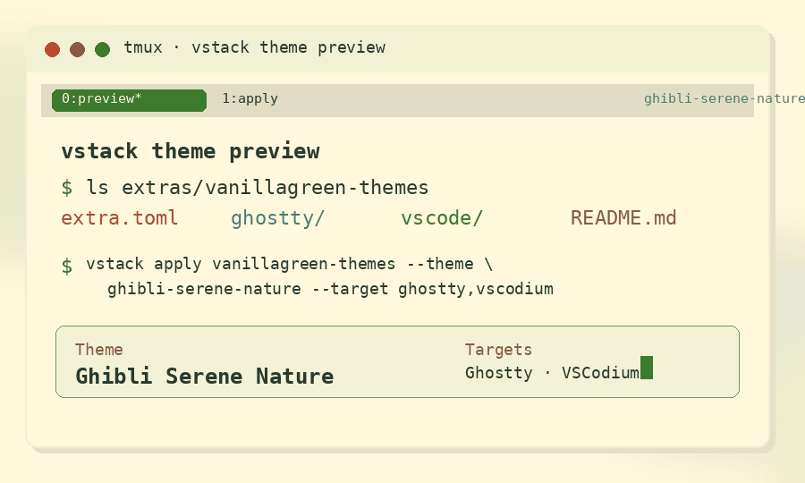

# vstack extras

Optional non-agent packages distributed by [vstack](../README.md). Currently one pack — `vanillagreen-themes` — bundling a VS Code-family theme/icon extension with matched Ghostty palettes/shaders, a tmux color block, and a Pi (coding-agent) theme.

## vanillagreen-themes



> some of the shaders/animations are better than others.. feel free to improve them and submit a PR!

24 color themes + 1 file/folder icon theme shipped as a single VS Code extension (`vanillagreen.vstack-themes`), with per-theme Ghostty palette + ambient shader pairs, per-theme tmux color block, and per-theme Pi (coding-agent) theme JSON. One `vstack apply` call installs the editor extension, switches the active editor + icon themes, swaps the live Ghostty palette, swaps the Ghostty `custom-shader`, rewrites the tmux color block (then reloads any live tmux servers), and registers + activates the matching Pi theme.

### Themes

Light (5):

- Anthropic
- Catppuccin Latte
- Ghibli Serene Nature
- Kawaii Pixel
- Rosé Pine Dawn

Dark (20):

- Anthropic Dark, Anthropic Slate
- Aura Dark
- Bearded Theme Monokai Black
- Catppuccin Frappé, Catppuccin Macchiato, Catppuccin Mocha
- Citrus
- Dracula
- Flowers
- Iceberg
- Pixel Corsair
- Retro City Console
- Rosé Pine, Rosé Pine Black, Rosé Pine Extra Black, Rosé Pine Moon
- Tokyo Night
- Warp

### Icon theme

`Rosé Pine Icons` — 326-icon Rose Pine-tinted set, available under *Preferences → Theme → File Icon Theme* in any editor that has the extension installed.

### Install + apply

```bash
# Add the vstack source (once).
vstack add vanillagreencom/vstack

# Apply a theme. Default scope is global/user (app themes are user-level config).
vstack apply vanillagreen-themes --theme ghibli-serene-nature --target ghostty,vscodium,cursor
vstack apply vanillagreen-themes --theme rose-pine            --target ghostty,vscodium

# Preview without writing anything.
vstack apply vanillagreen-themes --theme dracula --dry-run
```

Targets: `ghostty`, `vscode`, `vscodium`, `cursor`, `tmux`, `pi`. Add `--target` to restrict; omit to apply to every detected target.

There is no "installed vs not" — only **active vs not**. `vstack apply <theme>` is idempotent: it (re)installs the extension VSIX and switches the active color + icon themes. Settings.json (VS Code-family and Pi), `~/.config/ghostty/config`, and `~/.tmux.conf` (or `~/.config/tmux/tmux.conf`, whichever exists) are backed up before every mutation.

### What each target writes

| Target | Writes | Reload |
|---|---|---|
| `ghostty` | per-theme `themes/vstack/<id>` + shaders under `shaders/vstack/`; managed `config-file =` / `alpha-blending = linear-corrected` / `custom-shader =` block in the live Ghostty config. | macOS triggers Ghostty's **Reload Configuration** menu via AppleScript (fallback: SIGUSR2); Unix sends SIGUSR2 to running ghostty processes. |
| `vscode` / `vscodium` / `cursor` | per-call VSIX install of `vanillagreen.vstack-themes`; flips `workbench.colorTheme` and `workbench.iconTheme` in user `settings.json` (JSONC comments preserved). | Editor picks the new theme up live; reload window if it lingers. |
| `tmux` | per-theme `vstack-active-theme.conf` under `~/.config/tmux/`; one-line managed `source-file -q "…"` block in your `tmux.conf`. | `vstack apply` runs `tmux -S … source-file <conf>` against every live server it finds. |
| `pi` | per-theme `vanillagreen-<id>.json` under `~/.pi/agent/themes/`; flips top-level `theme` key in `~/.pi/settings.json`. | New Pi sessions pick up the theme on launch; in a live Pi session use `/theme` to switch or `/settings reload`. |

macOS Ghostty note: bundled GLSL is authored to match Linux/OpenGL's bottom-left `gl_FragCoord` convention. On macOS, vstack rewrites installed shader copies so positional code sees the same coordinate space, preserves the native terminal framebuffer sample orientation, and forces `alpha-blending = linear-corrected` so the shader text/background mask matches Linux.

The tmux block is colors-only (status/window/pane/border/mode/copy-mode-selection/clock); no `status-left/right` or `window-status-format`, so your own status bar layout is preserved. Remove the `# vstack:begin … # vstack:end` block from your `tmux.conf` to opt out. The Pi theme JSONs follow the [`coding-agent` theme schema](https://raw.githubusercontent.com/earendil-works/pi/main/packages/coding-agent/src/modes/interactive/theme/theme-schema.json) — to opt out, delete the matching `~/.pi/agent/themes/vanillagreen-*.json` and unset `theme` from `~/.pi/settings.json`.

### Attribution

The pack redistributes content from several MIT-licensed upstream projects (combined and themed for vanillagreen); full notices preserved in `vanillagreen-themes/vscode/LICENSE.txt`. Upstream sources include `catppuccin.catppuccin-vsc`, `dracula-theme/visual-studio-code`, `cocopon/vscode-iceberg-theme`, `avetis.tokyo-night`, `beardedbear.beardedtheme`, `mvllow.rose-pine`, and `ravenothere.rose-pine-symbols` (itself a fork of `miguelsolorio/vscode-symbols`).
