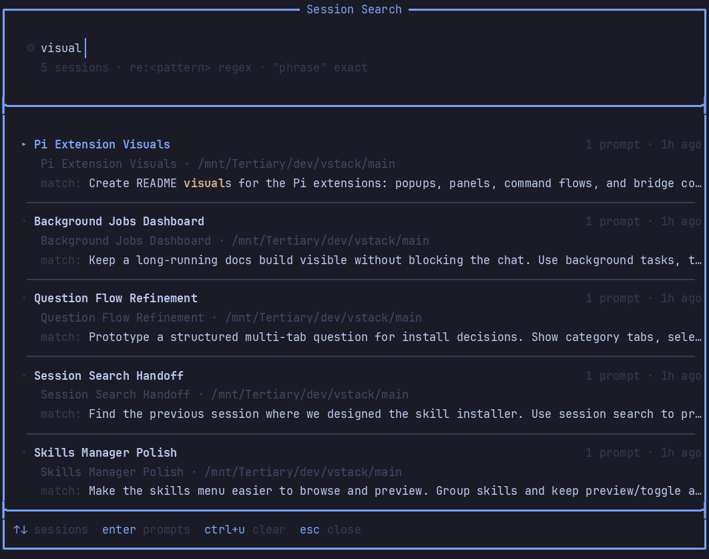

# pi-qol

Quality-of-life extension for Pi.

## What it provides

- Reliable multiline input: `Shift+Enter` / `Shift+Return` inserts a newline when the terminal reports it distinctly; `ctrl+j` is the default fallback newline key. `Alt+Enter` is reserved for Pi follow-up messages.
- Compact image placeholders: existing pasted image paths can collapse to `[Image #N]` aliases and are attached on submit.
- Session naming: `/session-name [name]` sets or shows the friendly session name; automatic first-prompt naming is enabled by default.
- Previous-session search: `/search` and optional `F3` overlay search prior sessions, preview snippets, resume, inject summarized context, or start a new session with summarized context.
- Handoff: `/handoff <goal>` drafts a focused prompt for a new session, preserving the latest compaction summary plus retained branch entries.
- Optional permission gate: when enabled, prompts before configured `bash` tool command fragments run; default match is `rm -Rf`.
- Notifications: terminal/tmux/native notifications for ready-for-input, questions, direction needed, task completion, and critical/blocked states.
- Optional custom compaction and idle compaction; disabled by default so Pi's compaction behavior is unchanged until enabled.
- Thinking timer next to collapsed `Thinking...` labels; enabled by default and falls back to Pi defaults if internals change.

## Commands

| Command | Action |
| --- | --- |
| `/qol status` | Show QOL status and key settings. |
| `/qol notify-test` | Send a test notification. |
| `/qol attachments` | List image placeholders and existing image paths in the current draft. |
| `/qol collapse` | Collapse existing image paths in the editor to `[Image #N]` aliases. |
| `/qol reset` | Clear QOL attachment status and tmux window mark. |
| `/qol rename` | Regenerate the current session name from the first user prompt. |
| `/qol rename status` | Show auto-rename settings and current session name. |
| `/qol rename full` | Regenerate the session name from the full conversation. |
| `/session-name [name]` | Set or show the current session's friendly name. |
| `/search [query]` | Open previous-session search, optionally prefilled with a query. |
| `/search resume <sessionPath>` | Resume a session by path. |
| `/search refresh` | Refresh the session search cache. |
| `/search stats` | Show session search cache stats. |
| `/handoff <goal>` | Draft a focused handoff prompt for a new session. |

`/qol` and `/search` arguments support autocomplete.

## Settings

Settings are exposed through `pi-extension-manager` under **QOL**.

### Session auto-rename

- `sessionAutoRename.enabled`: automatically name unnamed sessions after the first prompt/agent turn; default on.
- `sessionAutoRename.model`: naming model (`provider/model`, `current`, or `cheapest`); default `openai-codex/gpt-5.4-mini`.
- `sessionAutoRename.fallbackModel`: fallback model; default `current`, or `none`/`off` to skip.
- `sessionAutoRename.fallback`: deterministic fallback when model naming fails: `words`, `truncate`, or `none`.
- Advanced knobs: `prefix`, `maxInputChars`, `maxNameChars`, `maxTokens`, `timeoutMs`, `prompt`, `notify`, and `debug`.

### Session search

- `sessionSearch.enabled`: register `/search` and the overlay.
- `sessionSearch.shortcutKey`: shortcut to open search; default `f3`, set `none` to disable.
- `sessionSearch.sortMode`: `relevance` or `recent`.
- Result/layout knobs: `resultLimit`, `maxVisible`, `messageMaxVisible`, `previewSnippets`, `overlayWidth`, `cacheTtlSeconds`.
- Summary knobs: `summaryModel`, `summaryMaxTokens`, `summaryInputMaxChars`.

Search rows use Pi's `/resume`-style title: explicit session name, otherwise first user prompt, otherwise filename.

### Notifications

- Master and trigger toggles: `notification.enabled`, `onAgentReady`, `onDirectionNeeded`, `onQuestion`, `onTaskComplete`, `onCritical`.
- Channels: BEL, native terminal notifications, tmux client TTY writes, tmux messages, optional tmux window marking, and Pi UI notifications.
- `notification.oscProtocol`: `auto`, `osc777`, `osc99`, or `off`; `auto` uses Kitty OSC 99 when available, otherwise OSC 777.
- Tuning: `cooldownSeconds`, `title`, `readyMessage`, `bodyMaxChars`, `tmuxMessageDurationMs`, and tmux mark text/duration.

Use `/qol notify-test` to verify your terminal/tmux notification path.

### Permission gate

- `permissionGate.enabled`: ask before matching `bash` tool calls; default off. When enabled, non-interactive matches are blocked.
- `permissionGate.commands`: comma-separated literal fragments or `/pattern/flags` regexes; default `rm -Rf`.
- `permissionGate.previewLines` / `permissionGate.previewChars`: cap the approval prompt preview; long commands show a compact head/tail preview while the full command still runs only if approved.

### Compaction

- `compaction.customEnabled`: use QOL custom summaries for Pi compaction events; default off.
- `compaction.model`: summarizer model; default `google/gemini-2.5-flash`.
- `compaction.profile`: `concise`, `balanced`, or `exhaustive`.
- `compaction.remoteEnabled` / `compaction.remoteEndpoint`: call a remote summarizer with `{ systemPrompt, prompt, maxTokens }` and expect `{ summary }`.
- `compaction.branchSummaryEnabled`: use the same summarizer for requested `/tree` branch summaries.
- `compaction.idleEnabled` and related thresholds: extension-managed idle compaction trigger.

### Thinking timer

- `thinkingTimer.enabled`: show elapsed time next to collapsed `Thinking...` labels when the model emits thinking blocks.

## Notes

Pi owns native pending image attachment state and does not expose it to extensions. QOL can attach image paths it collapses itself; native Pi paste/drag attachments remain Pi-owned.
