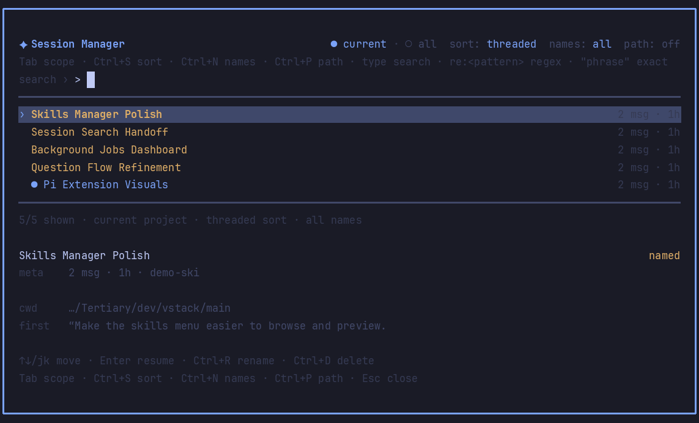

# pi-session-manager

Polished session manager overlay for Pi. It complements Pi's built-in `/resume` picker with vstack settings, inline management actions, and guarded rendering for long or control-character-heavy session text.

## What it provides

- Browse current-project sessions or all sessions.
- Search by fuzzy tokens, quoted phrases, or `re:<regex>` across titles, IDs, paths, cwd, and transcript text.
- Threaded lineage view using Pi `parentSession` relationships when there is no active search.
- Resume through `ctx.switchSession()`.
- Rename sessions using Pi session-info entries; current-session renames go through `pi.setSessionName()`.
- Delete one session or all shown deletable sessions with confirmation, current-session protection, and optional `trash` CLI fallback.
- Clean one-line rendering for names, prompts, and paths.

No SQLite, FTS, or native runtime dependencies are used; Pi's `SessionManager.list()` / `listAll()` APIs provide the index data.

## Commands

| Command | Action |
| --- | --- |
| `/sessions` | Open the manager using the configured default scope; switch Current/All with the tabs. |

## Keys

| Key | Action |
| --- | --- |
| `↑` / `↓` | Move selection. |
| `-` / `=` | Page the list. |
| `Home` / `End` | Jump to first/last result. |
| `Enter` | Resume selected session. |
| `Ctrl+R` | Rename selected session inline. |
| `Ctrl+D` | Delete selected session after confirmation. |
| `Ctrl+X` | Delete all shown deletable sessions after confirmation. |
| `Tab` | Toggle current/all scope. |
| `Ctrl+S` | Cycle threaded/recent/relevance sort. |
| `Ctrl+N` | Toggle named-only filter. |
| `Ctrl+P` | Toggle full session path in row metadata. |
| `Esc` / `Ctrl+C` | Clear search, cancel rename/delete, or close. |

The global shortcut defaults to `Alt+Shift+R` — it pre-fills `/sessions` into the prompt; press Enter to open the manager. Set `shortcutKey` to `none` to disable it.

## Settings

Settings are exposed through `pi-extension-manager` under `vstack.extensionManager.config.pi-session-manager`.

| Key | Default | Notes |
| --- | --- | --- |
| `enabled` | `true` | Registers commands and shortcut after reload. |
| `shortcutKey` | `alt+shift+r` | Pre-fills `/sessions` into the prompt when Pi is idle; press Enter to open. Set to `none` to disable. |
| `defaultScope` | `current` | Initial Current/All tab when opening `/sessions`. |
| `defaultSort` | `threaded` | `threaded`, `recent`, or `relevance`. |
| `visibleRows` | `12` | List rows before scrolling. |
| `overlayWidth` | `112` | Preferred overlay width in terminal columns. |
| `deleteUsesTrash` | `true` | Try `trash` before `unlink` when deleting. |

## Notes

- Session titles mirror Pi `/resume`: explicit session name, first user message, then filename.
- If `sessionDir` or `PI_CODING_AGENT_SESSION_DIR` is configured, current scope filters by session `cwd`; all scope shows every session in that directory.
- Pi's built-in `/resume`, `/tree`, `/fork`, `/clone`, and `/name` remain available.
