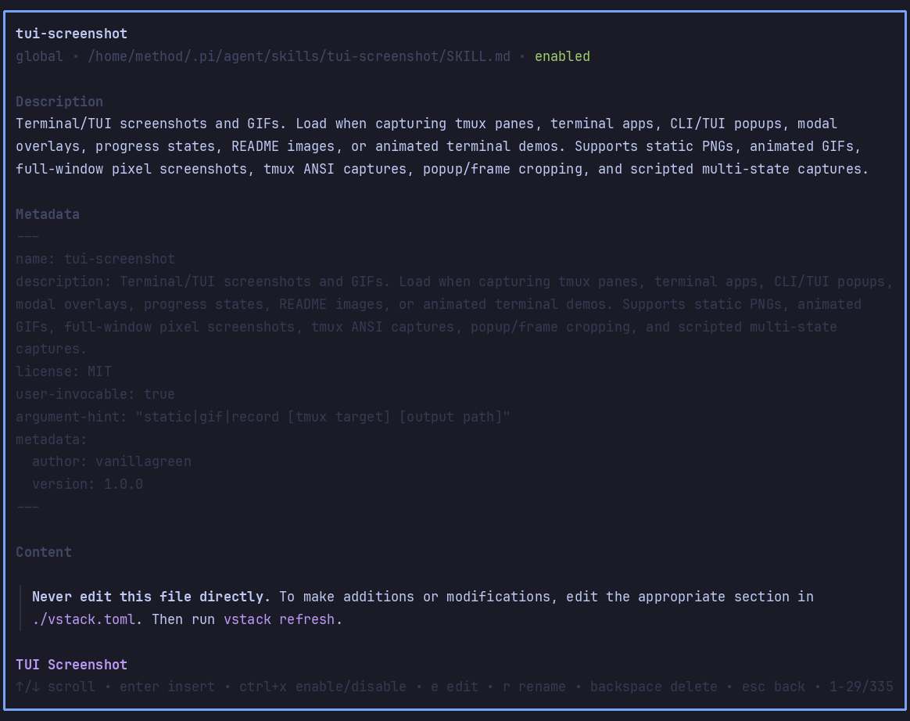

# pi-skills-manager

Dedicated Pi skills manager for vstack packages. It replaces a crowded slash menu full of `/skill:*` entries with one `/skills` workflow for browsing, previewing, inserting, creating, editing, renaming, deleting, and enabling/disabling skills.

## Commands

| Command | Action |
| --- | --- |
| `/skills` | Open the skills manager overlay. |
| `/skills disable` | Disable the manager feature toggle; run `/reload` to unload hooks/commands. |
| `/skills enable` | Recovery command when disabled; enables the manager and reloads. |

Arguments support autocomplete.

## What it does

- Hides native `/skill:<name>` commands by writing `enableSkillCommands: false` to the matching Pi settings scope.
- Hides Pi's default startup `[Skills]` block so skill discovery lives in the manager.
- Shows project/global skills separately from package/library skills.
- Searches by name, description, source, scope, and path.
- Inserts enabled skills into the editor as `[skill] <name>` markers; on submit, markers become a compact `● skills ... loaded` chat row while full `<skill>` content is injected into model context.
- Previews frontmatter and rendered skill content.
- Toggles skills on/off through Pi settings filters; run `/reload` after toggles to fully apply prompt/resource changes.
- Creates new project/global skills with the current model and thinking level, falling back to a deterministic template if model auth is unavailable.
- Edits, renames, and deletes your own top-level project/global skills. Package skills are preview/toggle/insert only.

## Keys

Browse mode:

- Type to search.
- `↑/↓` selects.
- `Enter` inserts an enabled skill, or starts **Create new skill** from the first row.
- `Tab` previews the selected skill.
- `Ctrl+X` enables/disables the selected skill.
- `Backspace` deletes your own selected skill when the search box is empty.
- `Esc` clears search, then closes.

Preview mode:

- `↑/↓`, `PageUp/PageDown`, `Home/End` scroll.
- `Enter` inserts an enabled skill.
- `Ctrl+X` enables/disables.
- `e` edits, `r` renames, and `Backspace`/`d` deletes your own skills.
- `Esc` or `Tab` returns to browse.

Edit mode: `Ctrl+S` saves; `Esc` returns to preview.

Create flow:

1. Name, normalized to a lowercase skill slug.
2. Trigger-focused description.
3. Visibility: project (`.pi/skills/<name>/SKILL.md`) or global (`~/.pi/agent/skills/<name>/SKILL.md`).

## Settings

Settings are exposed through `pi-extension-manager` under **Skills Manager**:

- `enabled`
- `hideNativeSkillCommands`
- `hideStartupSkillsBlock`
- `cleanupIncompleteMarkers`
- `aiGenerationEnabled`
- `defaultCreateLocation`
- `popupWidth`, `popupMaxHeight`, `listRows`

## Notes

This package intentionally mutates Pi's top-level `enableSkillCommands` setting when `hideNativeSkillCommands` is enabled. Other vstack-specific settings live under `vstack.extensionManager.config.pi-skills-manager`.

## Attribution

This package is locally owned by vstack and is based on ideas and portions of the MIT-licensed [`@kmiyh/pi-skills-menu`](https://github.com/Kmiyh/pi-skills-menu). See `THIRD_PARTY_NOTICES.md`.
