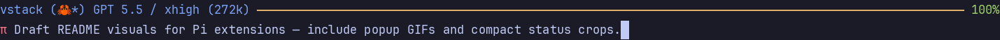

# pi-statusline



Compact Claude-style status line and single-line prompt for interactive Pi.

## What it does

- Replaces the default footer/editor chrome with a status line above the prompt.
- Shows project/repo name, branch/worktree badge, model, thinking level, context-window size, and remaining context percent.
- Uses a compact prompt prefixed with `π` and wraps long input cleanly.
- Reuses `pi-qol` image-chip behavior when rendering `[Image #N]` placeholders.
- Keeps autocomplete visible under the prompt.

## Install

Via vstack:

```bash
vstack add --agent pi
```

The vstack TUI lists this package under **Pi Extensions** and registers it in Pi's `settings.json` `packages` array.

Manual install:

```bash
pi install /path/to/pi-extensions/pi-statusline       # global
pi install -l /path/to/pi-extensions/pi-statusline    # project
```

## Updating a vstack checkout

After editing files under `pi-extensions/pi-statusline/`, run `vstack refresh` or `vstack add` again so installed Pi scopes pick up the change.

## Mode behavior

- Meaningful only in interactive Pi TUI mode.
- Safe to leave installed in RPC/JSON/print modes; TUI-specific calls no-op or degrade silently.
- Git metadata is best-effort and falls back to the current directory name if Git commands fail.
