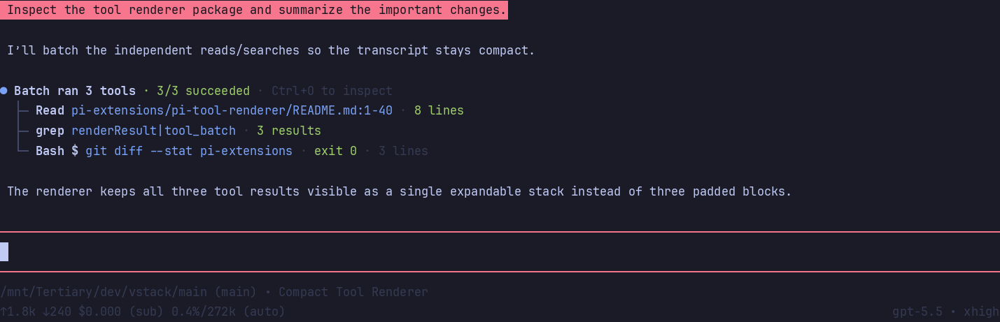

# pi-tool-renderer



Compact renderers for Pi tools, plus an optional `tool_batch` composite tool.

## Defaults

- Re-registers `read`, `bash`, and available `grep`/`find`/`ls` with compact self-rendered rows while delegating execution to Pi's original tools.
- Registers `tool_batch` so multiple independent read/search/list/diagnostic bash calls can render as one combined result.
- Leaves `edit` and `write` on Pi's built-in renderers by default so standard diff/edit UI is preserved.
- Compacts user-message cards by default (`compactUserMessages=true`).
- Keeps Pi's normal expand/collapse keybinding (`Ctrl+O`).

## `tool_batch`

`tool_batch` accepts calls for `read`, `grep`, `find`, `ls`, and diagnostic `bash`.

```json
{
  "calls": [
    { "tool": "read", "path": "README.md" },
    { "tool": "grep", "pattern": "registerCommand", "path": "pi-extensions" }
  ]
}
```

Prefer it for independent inspection calls. Do **not** use it for mutating commands, order-dependent commands, streaming output, or commands that should be inspected separately.

Per-call arguments can be flat, as above, or `{ "tool": "read", "args": { "path": "README.md" } }`.

## Optional renderers

Enable through `pi-extension-manager` settings:

- `renderMutationTools=true`: compact `edit`/`write` renderers with rich red/green diff summaries, hunk counts, syntax highlighting, and optional side-by-side previews (`splitDiffs`).
- `renderBashDiffs=true`: render unified/git diffs found in bash output with the same diff preview.
- `applyPatchRenderer` / `applyPatchPreview`: render `apply_patch` calls/results with parsed file patch previews.
- Generic OpenAI-style tool renderers for names such as `web_search`, `webfetch`, `fetch_content`, `Agent`, and `Task*`.
- MCP-looking tool renderers (`mcp`, `mcp__server__tool`, etc.) with `mcpOutputMode`.
- `workingIndicator`: optionally use a compact pulse or hide Pi's streaming indicator.
- `toolChrome`: optional global container chrome (`off`, `transparent`, or `outlines`).

Output modes can be tuned live with `readOutputMode`, `searchOutputMode`, `bashOutputMode`, and `mcpOutputMode`.

## Legacy stacking

`stackToolCalls=true` enables legacy stacking for separate native tool calls. It is disabled by default because current Pi still reserves spacer rows for hidden sibling tool entries. `stackChildDisplay` controls the tradeoff:

- `rows`: render child tools as separate compact `├`/`└` rows.
- `headline`: hide child rows and show the list only when expanded.
- `anchor-list`: hide child rows and show the compact list in the headline by default.

`hideStackChildRows` remains as a legacy alias for `stackChildDisplay="headline"` when `stackChildDisplay` is unset.

## Limits

This package changes rendering, not underlying tool execution or tool-result truncation. Hidden `Thinking...` labels and reserved spacer rows require Pi core renderer changes to remove completely.
