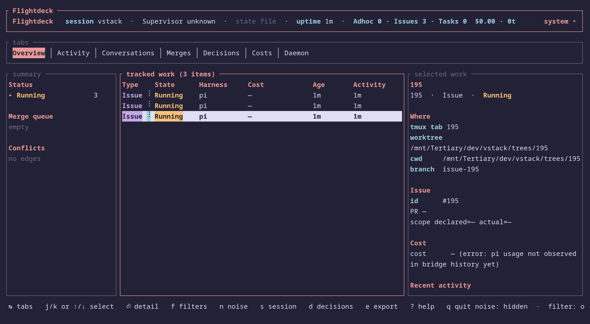

# Flightdeck


Flightdeck supervises AI agent sessions in tmux windows. It can track generic panes, run Linear issue cycles, run GitHub issue cycles, or orchestrate multi-item markdown plan files while routing prompts, showing progress, and summarizing completion.

> AI agents using Flightdeck: read [`SKILL.md`](./SKILL.md). Contributors changing Flightdeck internals: read [`DEVELOPMENT.md`](./DEVELOPMENT.md).

## Features

- Start or attach tracked agent panes in their own tmux windows.
- Watch multiple sessions at once and route prompts back to the right pane.
- Run generic sessions with no issue tracker.
- Run Linear issue workflows with planning, PR checks, merge ordering, and closeout summaries.
- Run GitHub issue workflows with PR/CI/review handling and verified issue closeout.
- Run plan-file workflows that split one markdown plan into item worktrees, panes, PRs, and dependency-aware merge supervision.
- After verified PR merges, safely fast-forward the local `main` checkout when possible and report dirty, ahead, or diverged cases without rewriting user work.
- After terminal issue/plan sessions, offer confirmation-gated cleanup for tracked worktrees plus local/remote branches whose PRs are authoritatively merged.
- Pause for humans on risky choices: scope creep, force-merge, issue aborts, domain mismatch, or novel prompt shapes; routine pre-PR round caps and merge-permission blocks are handled as autonomous workflow states, with daemon-scheduled rechecks for permission-blocked PRs and late-loop `P3`/`P4` review nits downgraded to non-blocking suggestions.
- Launch a terminal dashboard by default so sessions, prompts, PRs, activity, and costs stay visible.
- Keep durable run history under `~/.vstack/flightdeck` so completed run state survives project `tmp/` cleanup.
- Recover from common stalls with watchdogs for missing child completions, idle panes, edit loops, rate limits, and CPU-wedged Pi panes on Linux/procfs hosts.

## Install

```bash
cd /path/to/your/project
vstack add vanillagreencom/vstack --skill flightdeck -y
```

Requirements:

- tmux 3.x; Flightdeck no-ops outside tmux.
- bash 4+, jq, flock, bun.
- One supported harness adapter for each tracked pane: Pi bridge, OpenCode HTTP, Claude Channels, Codex app-server, or tmux fallback.
- Linear issue mode: Linear auth plus GitHub auth for PR helpers.
- GitHub issue mode: `gh` authenticated against the target repo.
- Plan lane: `gh` authenticated plus worktree creation configured; see [`PLAN-FILE.md`](./PLAN-FILE.md) for plan format.
- macOS: GNU coreutils for `sha256sum` and GNU date.

### Upgrade note: run-store permissions

vstack#227 tightened durable run-store permissions under `~/.vstack/flightdeck/projects`. Existing installs may still have legacy `0644` files or `0755` directories and then fail with errors such as `mode=644 expected 600`.

Review and repair safe legacy paths with:

```bash
vstack flightdeck migrate-permissions --dry-run
vstack flightdeck migrate-permissions
```

The command sets directories to `0700` and files to `0600`, logs each old→new mode, and refuses symlinks, foreign-owned paths, or group/other-writable paths.

## Commands quick reference

Run commands by asking your agent for `flightdeck <command>`.

### Session lane

| Command | Use when | Main args |
|---------|----------|-----------|
| `flightdeck session start` | Launch a new tracked pane. | `--session-id <ID> --title <T> --cwd <path> --harness <H> (--cmd <cmd> \| --prompt <text>)` |
| `flightdeck session attach` | Track an existing pane. | `--pane <%PANE_ID> --harness <H> --title <T>` |
| `flightdeck session watch` | Resume supervision for generic sessions. | `[ENTRY_ID...]` |
| `flightdeck session status` | Print tracked session state. | none |
| `flightdeck session stop` | Teardown a tracked entry. | `<ENTRY_ID>` |
| `flightdeck session remove` | Remove a tracked entry from state. | `<ENTRY_ID>` |

### Linear lane

| Command | Use when | Main args |
|---------|----------|-----------|
| `flightdeck linear start` | Start one Linear issue or choose one from main. | `[ISSUE_ID]` |
| `flightdeck linear start new` | Create a Linear issue, then start it. | `[title]` |
| `flightdeck linear start self` | Initialize master Linear issue session only. | none |
| `flightdeck linear parallel-check` | Check whether issues are safe to run together. | `[ISSUE_IDS]` |
| `flightdeck linear watch` | Resume Linear issue supervision. | `[ISSUE_IDS]` |
| `flightdeck linear merge-plan` | Recompute PR merge order. | none |
| `flightdeck linear close-issue` | Verify and close one issue workflow. | `<ISSUE_ID>` |
| `flightdeck linear terminate` | Summarize and unwind the Linear session. | none |

### GitHub lane

| Command | Use when | Main args |
|---------|----------|-----------|
| `flightdeck github start` | Start a numeric GitHub issue. | `<N> [--repo OWNER/REPO]` |
| `flightdeck github start new` | Create a GitHub issue, then start it. | `[title] [--repo OWNER/REPO]` |
| `flightdeck github watch` | Resume GitHub issue supervision. | `[N...]` |
| `flightdeck github close-issue` | Verify merged PR state, then close/no-op issue. | `<N>` |
| `flightdeck github terminate` | Summarize and unwind the GitHub session. | none |

### Plan lane

Plan-file orchestration turns one markdown plan into multiple item worktrees and child panes, then supervises each item PR through CI, review, merge, dependency unblocks, and cleanup. Plans can dictate explicit work items, or they can be freeform/narrative: Flightdeck analyzes the plan, does light repo reconnaissance when useful, infers PR-sized items, chooses worktree names, and decides dependency/parallel waves before presenting one preview. Master-only orchestration text is sanitized out of child briefs and reported in the preview. Format reference: [`PLAN-FILE.md`](./PLAN-FILE.md).

| Command | Use when | Main args |
|---------|----------|-----------|
| `flightdeck plan start` | Decompose a plan file, preview items, spawn dependency-free work items. | `<path>` |
| `flightdeck plan watch` | Resume plan supervision. | `[ITEM_ID...]` |
| `flightdeck plan close-item` | Verify merged PR state, then clean up one item. | `<ITEM_ID>` |
| `flightdeck plan terminate` | Summarize and unwind the plan session. | none |

## Settings users actually set

Most sessions work with defaults. These are the knobs users most often change.

| Variable | Default | Use when |
|----------|---------|----------|
| `FLIGHTDECK_AUTO_MERGE` | `1` | Set `0` to require human approval before merge or force-merge actions. |
| `FLIGHTDECK_AUTO_REBASE` | `0` | Set `1` in GitHub or plan mode to allow safe auto-rebase/update-branch prompts. |
| `FLIGHTDECK_FORCE_MERGE_AFTER_SECS` | `240` | Change how long Flightdeck waits before considering force-merge for approved, green PRs stuck in GitHub `UNKNOWN` merge state. |
| `FLIGHTDECK_CLAUDE_CHANNELS` | unset → `0` for linear tracker; defaulted to `1` for `--tracker github --harness claude` (vstack#216) | Set `1`/`0` to force Claude Channels on/off for a launch. Explicit `--use-channels`/`--no-channels` on `open-terminal` always wins. With channels on the daemon binds Claude's structured event stream and `flightdeck-daemon health` reports `subscriber_status=bound`; with channels off the daemon falls back to tmux scrollback polling and reports `skipped`/`stuck` until adapter metadata is supplied. |
| `FLIGHTDECK_LAUNCH_MODEL` | unset | Default model for panes launched from `open-terminal` or `flightdeck-session --prompt`. |
| `FLIGHTDECK_LAUNCH_EFFORT` | unset | Default effort/thinking level for launched panes. |
| `FLIGHTDECK_DISABLE_AUTO_RENAME` | `0` | Set `1` when tmux window titles spawned by `flightdeck-session start` should stay fixed instead of letting harnesses rename them. |
| `FLIGHTDECK_ENSURE_DAEMON` | `1` | Set `0` to skip the post-registration daemon staleness check inside `flightdeck-session start` / `attach`. Use only when the supervising master loop owns daemon lifecycle. |
| `FLIGHTDECK_MASTER_HARNESS` | auto | Override the supervisor harness used when arming `flightdeck-daemon --master-harness`; normally auto-detected, including Pi masters. |
| `FLIGHTDECK_DAEMON_BIN` | unset | Override the `flightdeck-daemon` trampoline used by `flightdeck-session ensure_daemon_for_session` and `flightdeck-state archive`'s daemon-stop helper. Validated as absolute path + executable; production operators should leave it unset (developer/test escape hatch). |
| `FLIGHTDECK_PANE_REGISTRY_BIN` | unset | Override the `pane-registry` trampoline used by `flightdeck-session ensure_daemon_for_session`. Test-only; see ENV.md. |
| `FLIGHTDECK_ARCHIVE_SKIP_DAEMON_STOP` | `0` | Set `1` to keep `flightdeck-state archive` from stopping the per-session daemon after terminating the active run. |
| `FLIGHTDECK_OPENCODE_VALIDATE_MODEL` | `1` | Set `0` only when using local OpenCode shims that are not listed by `opencode models`. |
| `FLIGHTDECK_STATE_DIR` | `tmp` | **Deprecated since vstack#227.** Live state now lives under `~/.vstack/flightdeck/projects/<id>/runs/<run-id>/`. Only consulted by the legacy migration shim. |
| `FLIGHTDECK_RUN_STORE_ROOT` | `$HOME/.vstack/flightdeck` | Override the user-level run-store root (tests/sandboxes). |
| `FLIGHTDECK_DASHBOARD` | `1` | Set `0` to disable automatic dashboard launch. |
| `FLIGHTDECK_DASHBOARD_WINDOW` | ` FD` | Change the tmux window name used for the dashboard app. |
| `FLIGHTDECK_DASHBOARD_WINDOW_ICON` | `1` | Set `0` to use plain `FD` as the default dashboard window name when no explicit name is set. |
| `FLIGHTDECK_DASHBOARD_THEME` | `moon` | Pick `moon`, `dawn`, `pantera`, or `system`. |
| `FLIGHTDECK_DASHBOARD_MOTION` | `full` | Pick `full`, `reduced`, or `off`; `NO_MOTION` and `NO_COLOR` also disable motion. |
| `FLIGHTDECK_DASHBOARD_BELL` | `1` | Set `0` to suppress terminal bell on pause-for-user. |
| `FLIGHTDECK_DASHBOARD_QUICK_FOCUS` | `0` | Set `1` to let dashboard `g` focus a tmux window without confirmation. |
| `FLIGHTDECK_DASHBOARD_PRICING_FILE` | bundled table | Point dashboard cost calculations at a custom pricing TOML. |
| `VSTACK_AGENT_END_WATCHDOG` / `VSTACK_STALL_WATCHDOG` / `VSTACK_EDIT_LOOP_DETECTOR` / `VSTACK_RATE_LIMIT_WATCHDOG` / `FD_BUSY_STALL_WATCHDOG` | `1` | Set any to `0` to disable that recovery watchdog. |

Full env reference: [`ENV.md`](./ENV.md).

Dashboard settings can also be edited from inside the Rust dashboard. The
dashboard writes overrides to
`~/.vstack/flightdeck/projects/<project-id>/settings.toml` (vstack#227) and
reloads them on the next dashboard launch/command. Those overrides are scoped to
dashboard behavior; set shell env vars when the master workflow itself needs a
different value.

## Dashboard

The terminal dashboard opens automatically when `FLIGHTDECK_DASHBOARD=1` (default). It shows tracked work items, current tmux tab names, state, harness, PR/path, branch, age, last decision, activity, conversations, merge planning, daemon health, token/cost totals, and pause-for-user banners. The dashboard's own tmux window is hidden from the work table so the view stays focused on child work. In tmux, `flightdeck-dashboard focus-or-launch` focuses an existing app window or launches one if missing. Launch/focus first runs the active-run stale check, so an active run whose recorded panes all disappeared is rotated before dashboard pane verification. Child/session launches treat dashboard startup as best-effort: a dashboard CLI/path failure prints a warning and the tracked pane still launches so daemon supervision remains canonical.

The dashboard treats active and archived runs separately. Live mode reads the active run's `state.json` under `~/.vstack/flightdeck/projects/<id>/runs/<run-id>/` (vstack#227 unified state). Active pointers are per tmux session, so the same project can have separate active Flightdeck runs in different tmux sessions. If no matching active run exists, startup shows `No active Flightdeck run` instead of automatically rendering the newest terminated archive as if it were live. Press `H` to open the History popup, filter runs, expand snapshots inline, load an archived/imported snapshot read-only, import legacy project archives, or return to the active run with `A`. Read-only archive views disable stale-prune and tmux-focus actions.

The header's `state: live file` chip means the dashboard is watching Flightdeck's state file directly. That is normal live mode and is separate from the supervisor daemon that wakes the master agent. History/archive chips (`state: history archive`, `state: imported archive`, `state: legacy archive`) are read-only views. Socket telemetry is optional extra dashboard-side telemetry, not required for work/status rendering. Pi session costs are read from `pi-bridge history` when bridge metadata is available.

Useful commands:

```bash
flightdeck-dashboard focus-or-launch      # focus existing app, or launch in tmux
flightdeck-dashboard tui                  # current tmux session, live
flightdeck-dashboard tui --session <name>           # active run or no-active landing
flightdeck-dashboard tui --run-id <run-id>          # load durable run read-only
flightdeck-dashboard tui --run-id <run-id> --snapshot <timestamp-or-file>
flightdeck-dashboard tui --archive <path>           # load legacy project archive read-only
flightdeck-dashboard tui --demo                     # demo data
```

Use `flightdeck-state run list/show` for scriptable durable run inspection and `tui --state-file <path>` for a concrete master-state JSON file.

For keyboard shortcuts and dashboard legends, press `?` in the dashboard.

## Run history helpers

Flightdeck can create and inspect durable run records separately from the live tmux session files. This is mostly for dashboard/history tooling and post-mortems.

```bash
flightdeck-state run create --project-root "$PWD" --tmux-session <name> [--state-dir tmp]
flightdeck-state run ensure --project-root "$PWD" --tmux-session <name> [--state-dir tmp]
flightdeck-state run active --project-root "$PWD" --tmux-session <name>
flightdeck-state run active --project-root "$PWD" --all --json
flightdeck-state run list --project-root "$PWD" --json
flightdeck-state run show <run-id> --project-root "$PWD"
flightdeck-state run terminate <run-id> --project-root "$PWD"
flightdeck-state run terminate-active --project-root "$PWD" --tmux-session <name>
flightdeck-state run import-legacy --project-root "$PWD" --state-dir tmp
```

Normal Flightdeck start/attach and terminate/archive flows call the lifecycle helpers for you. If `flightdeck-session start` / `attach` creates a fresh active run and aborts before registering an entry, it terminates that new run; reused active runs are preserved. vstack#227: `flightdeck-state archive` writes the durable snapshot under `<run-dir>/snapshots/` and renames any pre-existing `<project>/tmp/flightdeck-state-<S>.json` to `.migrated` (`activity.jsonl`/`.lock` siblings get the same suffix). Importing legacy archives copies them into durable history and leaves the original `tmp/flightdeck-state-*.json.archive` files in place. Flightdeck does not delete durable runs or imported legacy archives by default; remove old `~/.vstack/flightdeck/projects/<project-id>/runs/<run-id>/` directories only as an explicit manual retention decision.

## High-level architecture

Flightdeck always runs inside one tmux session. The master agent owns the Flightdeck workflow and records tracked entries in the active run's durable state file. Each child agent runs in its own tmux window, never as a split of the active pane. Flightdeck talks to child panes through the best available native channel for that harness, with tmux as fallback. A daemon watches child panes and wakes the master only when there is work to do. The master classifies prompts, answers known safe shapes, pauses for risky or novel shapes, and updates state. Issue and plan lanes add GitHub/Linear/worktree checks on top of the same session loop. The dashboard reads the same state and activity data the workflows already write; it does not replace the workflows.

```
user request
  -> master agent
  -> Flightdeck workflow
  -> tmux child windows
  -> daemon wake + prompt routing
  -> dashboard + final summary
```

## More docs

- AI agent operating rules: [`SKILL.md`](./SKILL.md)
- Plan file format: [`PLAN-FILE.md`](./PLAN-FILE.md)
- Full script reference: [`SCRIPTS.md`](./SCRIPTS.md)
- State and activity schema: [`SCHEMA.md`](./SCHEMA.md)
- Env reference: [`ENV.md`](./ENV.md)
- Watchdog reference: [`WATCHDOGS.md`](./WATCHDOGS.md)
- Prompt tag reference: [`PROMPT-TAGS.md`](./PROMPT-TAGS.md)
- Development and testing: [`DEVELOPMENT.md`](./DEVELOPMENT.md)
